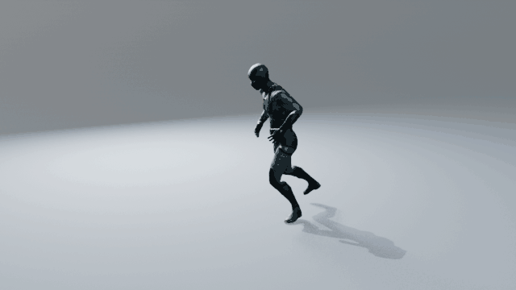
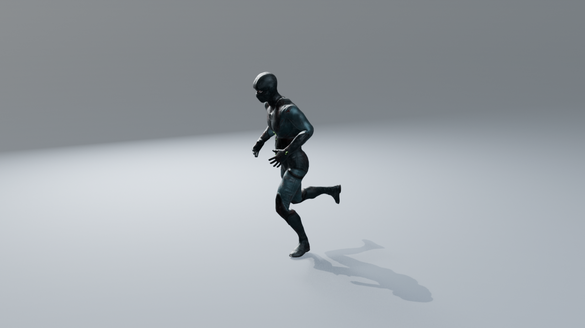
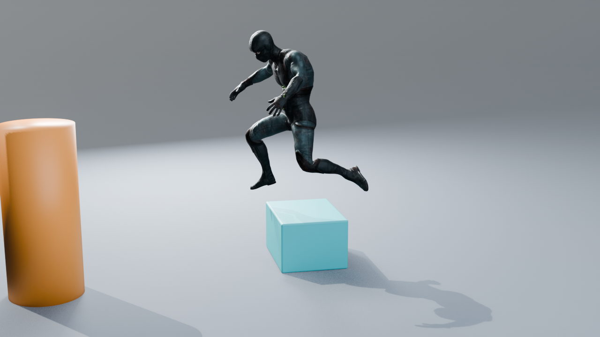
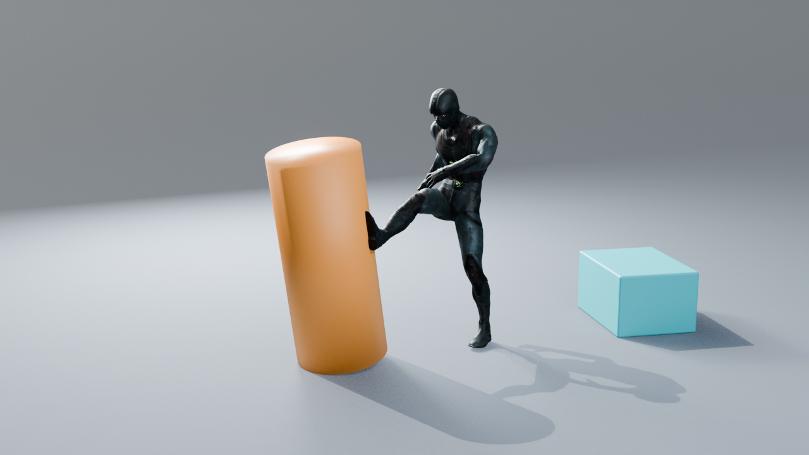

# UniMate-B3D

**Local text-to-motion for simple deform-bone rigs in Blender.** This is a fork of [Friedrich-M/UniMate](https://github.com/Friedrich-M/UniMate) that adds a Blender panel, a separate inference backend, prompt timelines, pose references, and an editable Blender Action. Maintained by [@nopeburger](https://github.com/nopeburger).

| Running | Jumping over a cube | Front kick |
| :---: | :---: | :---: |
|  |  |  |

The animation above is a 210-frame, three-prompt timeline on a [Mixamo](https://www.mixamo.com) character, generated with the **Mixamo model for humans** and seed 21: frames **1–90** *"A human runs forward."*, **91–150** *"A human jumps far forward with both feet and lands."* and **151–210** *"A human does a front kick with the right leg."* The cube and cylinder are placed to match the result; the model does not see scene geometry. The character is Mixamo content and is not distributed here, so only the renders are included. Mixamo characters import with their FBX orientation and the **Animate finger bones** option controls whether the hands are driven.

The repository also includes an older [demo scene](demo/UniMate_Run_Jump_Sword.blend) with a generic human deform rig, sword, obstacle cube, ground plane, and a 180-frame Action (run, jump over the cube, sword swing). Open it in Blender and press Play; the animation works without the model weights. That Action began with UniMate output, then received a deterministic 1.5-unit forward jump arc and contact/knee cleanup so it clears the visible cube.

## Requirements

- Blender **4.2 or newer**. The regression tests pass on Blender 4.2, 5.1 and 5.2.
- Windows, standard **Python 3.10**, and an NVIDIA GPU compatible with the bundled CUDA 12.4 PyTorch requirements for the provided setup script. Other platforms need their own PyTorch installation and setup adjustments.
- Several GB of free space: the Python dependencies (mostly PyTorch), the two UniMate checkpoints and the pose model (about 2 GB, downloaded by setup), and the text encoder (about 1 GB, downloaded on the first generation). Model weights are not in this repository or the add-on ZIP.

Inference runs in a separate Python environment. Blender's Python does not need PyTorch.

## Install

1. Clone this fork: `git clone https://github.com/nopeburger/UniMate-B3D.git` and enter `UniMate-B3D`.
2. With Python 3.10 available through the Windows `py` launcher, run `powershell -ExecutionPolicy Bypass -File .\scripts\setup.ps1` from the repository root. You can pass `-Python <path-to-python-3.10>` if needed. This creates `.venv` and downloads the general UniMate model, the Mixamo-only UniMate model and the human-pose model into `models/` (about 2.2 GB).
3. In Blender, choose **Edit → Preferences → Get Extensions → Install from Disk** (or **Add-ons → Install from Disk**, depending on Blender version), select [`dist/unimate_motion-0.6.0.zip`](dist/unimate_motion-0.6.0.zip), and enable **UniMate Motion**.
4. In the 3D View, open the sidebar with **N**, select **UniMate**, and expand **Setup and generation settings**. Set **Project folder** to the cloned repository root and **Model folder** to `models/unimate_uniml3d_f60_v2` inside that root. These paths are local settings and are not bundled in the demo.

To build the add-on ZIP from source instead, run `python scripts/package.py`. Its package is intentionally small; the backend and weights stay in the cloned project.

## Add-on panel

The [Blender add-on panel guide](docs/BLENDER_ADDON_GUIDE.md) explains every control, including rig setup, prompt ranges, pose references, cleanup, generation, and advanced settings. It also shows screenshots of the single-prompt, timeline, pose-reference, and advanced panels.

| Single prompt | Prompt timeline |
| :---: | :---: |
|  |  |

## Generate motion

1. Select a simple, single-root deform armature, or assign it in **Rig**. Choose **Human**, **Animal / Creature**, or **Other articulated model**, set the world direction the character faces at rest, and click **Check Rig**. Imported rigs such as Mixamo FBX files work as imported (Y-up, 0.01 scale); for rigs with full hands, turn off **Animate finger bones** to stay within the model's joint limit. For **Human** rigs that fit in 22 joints, the add-on uses the Mixamo-only model, which gives clearly better human motion than the general model; for a Mixamo character, turn off **Animate finger bones** and **Animate terminal bones** to get there. **Check Rig** reports which model will be used.
2. For one motion, choose **Single prompt**, enter the prompt, frame count, and start frame. For a sequence, choose **Prompt timeline** and add prompt clips with inclusive, consecutive frame ranges. There can be no gaps or overlaps. The model generates 60-frame windows; a clip longer than one window gets chained windows, so it contains new motion rather than a slowed-down copy (turn off **Generate long clips in full** to stretch one window instead).
3. Optionally assign a static **Ground mesh** in the advanced settings. **Motion cleanup** is enabled by default and estimates self-collisions, ground penetration, stance, foot/paw tilt, and support-limb bend from the rig's weighted meshes.
4. Click **Generate Motion**. Blender remains interactive while the local backend runs. When the status reports that motion is ready, click **Apply Motion**. This creates a new Action; save your `.blend` file.

The first generation also fetches the text encoder into the local cache. With **Keep model loaded** (on by default), the backend stays running between generations so later runs skip model loading; it unloads after 15 idle minutes, with **Unload Model** or **Cancel Generation**, when another file is opened, or when Blender closes. Each job writes its request, status, log, and result under the local `outputs/` directory. These files are excluded from Git.

### Pose references

Each prompt clip can contain one or more reference images assigned to target frames. For a **human**, choose the image, click **Estimate Human Pose**, review or change the human bone mapping, click **Preview Estimated Pose**, adjust the rig if needed, and click **Capture Current Pose**. For a **creature**, use the image as a guide to pose the rig manually, then capture it. The captured pose is the actual constraint; selecting an image alone does not impose a pose. It fixes the joint rotations, root height and facing direction at its frame, while the model still generates the horizontal travel. Uncaptured references stop generation with an error.

**Prompt blend frames** smooth joins between clips. **Pose approach frames** ease into a captured reference within its clip. Both controls can be set to zero. Cleanup may adjust an intersecting captured pose; turn it off when exact reference rotations matter more. Single-image human pose estimation cannot reliably infer hidden limbs, depth, or ground contact, so review every estimate.

## Scope and limits

This is an experimental adapter for **simple deform-bone human and creature rigs**, including multi-legged, winged, serpentine and marine bodies and robots (see [Creatures, robots and other body plans](docs/BLENDER_ADDON_GUIDE.md#creatures-robots-and-other-body-plans)). Active pose constraints, drivers, NLA tracks, and control rigs are not supported directly. Deform bones without any skin weights (such as Mixamo's `_End` helper bones) are left out of the export. The downloaded v2 checkpoint permits at most **71 model joints**, counting virtual terminal joints. The armature object needs a uniform, positive scale. Motion cleanup uses capsule proxies derived from skin weights and heuristic foot contact; it is not a physics simulation and cannot guarantee collision-free output on every mesh. Contact uncertainty is reported in job results. Creature pose images are manually matched in this version.

The models know some actions much better than others. The Mixamo model handles upright human motion (walking, running, jumping, turning, kicking, dancing) well. Floor-level actions are weak with both models: crawling works best with **Mixamo model for humans** turned off and a hands-and-knees pose reference, and sitting down onto the ground does not produce a natural transition. For actions like these, pose references at the key poses do most of the work. Snakes, swimmers, spinning robots and many-legged walks are also weak; the guide lists [known weak results](docs/BLENDER_ADDON_GUIDE.md#known-weak-results) for each body plan and what helps.

The backend builds UniMate conditioning from the Blender rest skeleton and uses upstream model/sampler code without editing the upstream source. See [the original README](docs/UPSTREAM_README.md) and [the UniMate project](https://github.com/Friedrich-M/UniMate) for the underlying research and model.

## Licenses and credits

Upstream UniMate code is MIT licensed; its original [license](LICENSE) and [README](docs/UPSTREAM_README.md) are retained. The Blender integration in `addon/unimate_motion` is GPL-3.0-or-later ([license](addon/unimate_motion/LICENSE.txt)). The integration also includes the upstream MIT notice ([notice](addon/unimate_motion/UNIMATE_LICENSE.txt)). No training dataset, model weights, external character assets, or development outputs are bundled.

**Model weights are not covered by these code licenses.** The released [UniMate checkpoints](https://huggingface.co/Linzhan/UniMate) are licensed **CC BY-NC 4.0** (non-commercial). Check that license before using the model or its generated motion commercially.

## Contributing

See [CONTRIBUTING.md](CONTRIBUTING.md) for the development setup, the regression tests in `tests/`, and how to keep the merged upstream code current.
