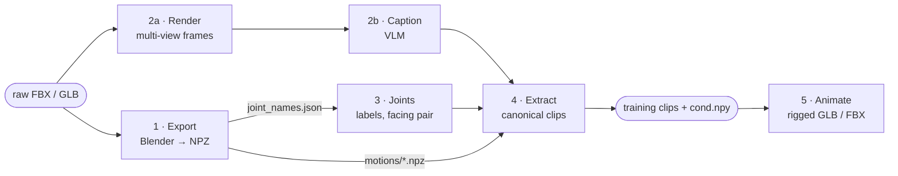

# UniML3D Data Pipeline

This pipeline turns rigged assets (Truebones FBX, Mixamo FBX, Objaverse GLB, or your own) into **[UniML3D](https://huggingface.co/datasets/Linzhan/UniML3D)**: text-paired, topology-annotated motion clips for training UniMate. It also prepares a single rigged asset for a trained model ([`rig_preprocess`](rig_preprocess/README.md)).

Run every command from the repository root. Every wrapper in `data_process/scripts/` prints its options with `-h`.

> [!TIP]
> To train on UniML3D you do not need to run stages 1 to 3. Their output is published, so stage 4 alone rebuilds the training clips ([Prebuilt export](#prebuilt-export)).

## Contents

- [Overview](#overview)
- [Setup](#setup)
- [Raw data](#raw-data)
- [Quick start](#quick-start)
- [Stage 1: Export](#stage-1-export)
- [Stage 2a: Render](#stage-2a-render)
- [Stage 2b: Caption](#stage-2b-caption)
- [Stage 3: Joint annotation](#stage-3-joint-annotation)
- [Stage 4: Extract](#stage-4-extract)
- [Stage 5: Animate](#stage-5-animate)
- [Custom assets](#custom-assets)
- [Data formats](#data-formats)
- [Tools](#tools)
- [Conventions](#conventions)
- [Troubleshooting](#troubleshooting)

## Overview



| Stage | Wrapper | Input | Output |
|---|---|---|---|
| 0 Download | `run_download.sh` | Hugging Face Hub | `dataset/raw/<dataset>/` |
| 1 Export | `run_export.sh` | raw FBX / GLB | `export/<dataset>/motions/*.npz`, `joint_names.json`, previews |
| 2a Render | `run_render_motion.sh`, `run_render_tpose.sh` | raw assets | `render/<dataset>/<clip>/v00{0..3}/`, T-pose grids |
| 2b Caption | `run_caption_motion.sh`, `run_caption_category.sh` | renders | `motion_captions.json`, `category_groups.json` |
| 3 Joints | `run_joints_*.sh` | `joint_names.json` | `clean_joint_names.json`, `face_joint_names.json` |
| 4 Extract | `run_extract_features.sh` | stage 1 to 3 output | `features/<dataset>/motions/*.npz`, `cond.npy`, `captions.json` |
| 5 Animate | `run_animate_*.sh` | a motion and a rigged mesh | animated `.glb` / `.fbx` |

Stages 1 and 2a both read the raw assets and are independent. Stage 3 needs stage 1, stage 2b needs stage 2a, and stage 4 needs all of them.

> [!NOTE]
> Raw Mixamo FBXs are animations without a mesh, so Mixamo renders an animated character first: export, then `run_animate_mixamo.sh`, then render and caption. Its output ships in the Mixamo repository as `animation_motion_ybot/`.

## Setup

The pipeline uses the repository's `unimate` conda environment ([setup](../README.md#%EF%B8%8F-environment-setup)), plus:

| Requirement | Used by |
|---|---|
| [Blender](https://www.blender.org/) ≥ 3.2 on `PATH` | stages 1 and 5 (`blender -b`) |
| pip [`bpy`](https://pypi.org/project/bpy/) 4.0.0 (in the environment) | stage 2a: EEVEE needs the module's GPU context, so this stage runs under plain `python` |
| CUDA GPU | stages 2a and 2b, and stage 3 with a local LLM |
| `OPENAI_API_KEY`, `GOOGLE_API_KEY` or `DEEPSEEK_API_KEY` | API backends of stages 2b and 3 |

`ffmpeg` (through `imageio-ffmpeg`) and the [`hf` CLI](https://hf.co/cli) come with the environment.

**Code.** One package per stage; wrappers in `scripts/`, shared code in `utils/`:

```
data_process/
├── scripts/             run_<stage>_<task>.sh entry points
├── motion_export/       stage 1   raw assets → NPZ (Blender)
├── motion_rendering/    stage 2a  multi-view renders, T-pose grids (EEVEE)
├── vlm_caption/         stage 2b  captions, body-plan categories (VLM)
├── joint_annotation/    stage 3   joint labels, facing pair (rules, LLM)
├── feature_extraction/  stage 4   canonical training clips, cond.npy, canonical assets
├── mesh_animation/      stage 5   drive a rigged mesh with a motion
├── rig_preprocess/      one rigged asset → cond.npy + canonical GLB, for a trained model
├── tools/               QA patching, visualizers, summary merging, FBX → GLB
└── utils/               shared library code
```

**Data.** All wrappers use this layout; each wrapper's header lists the environment variables that override it:

```
dataset/raw/<dataset>/                      raw assets
dataset/export/<dataset>/                   stage 1 output and the stage 2b / 3 annotations
dataset/render/<dataset>/<clip>/v00{0..3}/  stage 2a renders
dataset/render/<dataset>_tpose/             T-pose grids
dataset/features/<dataset>/                 stage 4 output: training clips, cond.npy
dataset/canonical_assets/<dataset>/         stage 4, optional: rest-pose assets in the canonical frame
```

`<dataset>` is `truebones`, `mixamo` or `objaverse`, or `general` for your own data ([Train on your own data](#train-on-your-own-data-optional)). The `dataset/render/` paths point into the raw mirrors: `raw/truebones/{animation_render,species_tpose}`, `raw/mixamo/{animation_motion_render,character_tpose}` and `raw/objaverse_renders/{glb_render,tpose}`.

## Raw data

```bash
bash data_process/scripts/run_download.sh mixamo              # dataset/raw/mixamo
bash data_process/scripts/run_download.sh objaverse           # dataset/raw/objaverse/glb
bash data_process/scripts/run_download.sh truebones           # dataset/raw/truebones (annotations only)
bash data_process/scripts/run_download.sh objaverse_renders   # dataset/raw/objaverse_renders (optional, ~6 GB)
```

| Name | Repository |
|---|---|
| `mixamo` | [Linzhan/Mixamo-Animations-Characters](https://huggingface.co/datasets/Linzhan/Mixamo-Animations-Characters) |
| `objaverse` | [Linzhan/Objaverse-XL-Rigged-Animated](https://huggingface.co/datasets/Linzhan/Objaverse-XL-Rigged-Animated) |
| `truebones` | [Linzhan/Truebones-ZOO-Annotations](https://huggingface.co/datasets/Linzhan/Truebones-ZOO-Annotations): prompts, metadata, renders and build scripts; no motion files |
| `objaverse_renders` | [Linzhan/Objaverse-XL-Rigged-Animated-Renders](https://huggingface.co/datasets/Linzhan/Objaverse-XL-Rigged-Animated-Renders): four-view clip MP4s and T-pose grids |

The Mixamo and Truebones repositories include the stage 2a renders as MP4s with camera JSONs. The per-frame PNGs that captioning reads are not hosted; stage 2a regenerates them.

> [!IMPORTANT]
> **Truebones motion files are not redistributed.** The Truebones ZOO pack is a commercial product. Purchase it from [Truebones](https://truebones.com), unpack it to `dataset/raw/truebones/Truebone_Z-OO/{Animal}/`, and run the downloaded `scripts/pipeline/` (see that repository's README) to build the per-clip layout `dataset/raw/truebones/animation/{Species}-{Action}.fbx`. Species names contain no `-`. Stage 5 also reads the meshes from the original per-animal layout; directory names are matched ignoring case and separators (object type `Dog2` → `Truebone_Z-OO/Dog-2/`).

### Prebuilt export

The output of stages 1 to 3 (motions, captions, joint labels, facing pairs, QA lists) is part of UniML3D, so stage 4 alone rebuilds the training clips:

```bash
hf download Linzhan/UniML3D --repo-type dataset --local-dir dataset --include "export/*"
# the Hub splits export/objaverse/{motions,videos} into 64 hash buckets; flatten them (hardlinks)
for d in dataset/export/objaverse/{motions,videos}; do find "$d" -mindepth 2 -type f -exec ln -f -t "$d" -- {} +; done
bash data_process/scripts/run_extract_features.sh objaverse
```

The Truebones motion NPZs are withheld for the license reason above; its captions and annotations are included.

## Quick start

All stages for Objaverse. Truebones is the same with `truebones`; Mixamo adds the animate step noted above.

```bash
bash data_process/scripts/run_download.sh objaverse                       # 0  raw data
bash data_process/scripts/run_export.sh objaverse --multi-worker 8        # 1  export
bash data_process/scripts/run_render_motion.sh objaverse --multi-worker 8 # 2a render
bash data_process/scripts/run_render_tpose.sh objaverse
bash data_process/scripts/run_caption_motion.sh objaverse --multi-gpu     # 2b caption (local Qwen3.5-9B)
bash data_process/scripts/run_caption_category.sh objaverse
bash data_process/scripts/run_joints_names_clean_llm.sh objaverse         # 3  joint labels
bash data_process/scripts/run_joints_face_select_llm.sh objaverse         #    facing pair
python data_process/tools/patch_annotations.py --datasets objaverse       #    QA fixes
bash data_process/scripts/run_extract_features.sh objaverse               # 4  training clips + cond.npy
```

Every stage is resumable: a rerun skips finished outputs and retries failures.

## Stage 1: Export

```bash
bash data_process/scripts/run_export.sh truebones                   # {Species}-{Action}.fbx clips
bash data_process/scripts/run_export.sh mixamo --no-vis             # skip MP4 previews (much faster)
bash data_process/scripts/run_export.sh objaverse --multi-worker 8
bash data_process/scripts/run_export.sh objaverse --save_glb        # also rigs/<asset>.glb
bash data_process/scripts/run_export.sh mixamo --glb_only           # only add the GLBs to an existing export
```

Each asset is imported in Blender, pruned of control and helper bones that carry no skin weight, converted to Y-up, and written as one NPZ per animation. Mixamo has its own preset, since its FBXs have no mesh. Joint counts are not filtered here; stage 4 decides which skeletons enter training.

`--save_glb` writes `rigs/<asset>.glb`: the asset's mesh and armature in its rest pose on the pruned skeleton, textures embedded, without animation. Its skeleton is that of the asset's clips, so every clip drives it directly. Mixamo writes one GLB per character in `CHAR_DIR` (default `dataset/raw/mixamo/character_refined`), in the character's rest pose on the shared clip skeleton; a character needs the 22 core joints, and one without finger bones is exported without them. Missing textures are listed in `rigs/texture_issues/` and failed builds in `rigs/glb_errors/`; neither fails the export. `--glb_only` adds the GLBs to an existing export, including the released one, and writes nothing else.

<details>
<summary>Outputs, parallelism, resume</summary>

| Path | Content |
|---|---|
| `motions/<clip>.npz` | one clip ([format](#data-formats)) |
| `videos/<clip>.mp4`, `tpose/<asset>.png` | skeleton previews (`--no-vis` skips them) |
| `joint_names.json` | `{asset: [bone names]}`, the input of stage 3 |
| `joint_count.json`, `clip_frames.json`, `summary.json` | joints per skeleton, frames per clip, totals |
| `.completed/<asset>.json` | completion markers; delete one to re-export that asset |
| `rigs/` | `--save_glb` / `--glb_only` output |

- `--multi-worker N` shards a directory over N Blender processes (objaverse, mixamo, general). Their summary shards are merged by `tools/merge_summaries.py` only when every worker succeeded. Truebones runs in one process, except with `--glb_only`.
- An `excluded.csv` (column `object_id` or `file`) in the input directory or its parent lists assets the objaverse and general exporters skip.
- Pruning is shared by all clips of an asset, so an asset completes as a whole. Its marker stores the pruned joint names, from which `joint_names.json` can be rebuilt.

</details>

## Stage 2a: Render

```bash
bash data_process/scripts/run_render_motion.sh objaverse --multi-worker 8
bash data_process/scripts/run_render_motion.sh objaverse --missing-only   # skip finished clips
bash data_process/scripts/run_render_tpose.sh objaverse
DATA_DIR=outputs/mixamo_characters bash data_process/scripts/run_render_motion.sh mixamo
```

Each clip is rendered with EEVEE from four cameras 90° apart (`v000` to `v003`), as per-frame PNGs and one MP4 per view (`--no-video` skips the MP4s). The captioner treats the views as unlabelled; the asset's front is defined later by its facing pair. `run_render_tpose.sh` renders a 2×2 T-pose grid per asset for body-plan classification.

<details>
<summary>Settings</summary>

- At most 200 frames are rendered per clip (`MAX_RENDER_FRAMES`); clips under 5 frames (`MIN_ACTION_FRAMES`) are skipped.
- `--fps` must match stage 1 (default 30 in both): glTF stores keyframe times in seconds.
- `--multi-worker N` with `NUM_GPUS=k` sets `CUDA_VISIBLE_DEVICES=i % k` per worker, but EEVEE's EGL context ignores it: on a shared machine, give each render job an allocation with one GPU.
- `--missing-only` applies to objaverse and general; the other datasets resume per asset.
- `RESOLUTION`, `SAMPLES` and `CAMERA_DIST` set the quality.

</details>

## Stage 2b: Caption

```bash
bash data_process/scripts/run_caption_motion.sh objaverse --multi-gpu                    # local Qwen/Qwen3.5-9B
MODEL=Qwen/Qwen3.8-27B bash data_process/scripts/run_caption_motion.sh objaverse         # local, one 80 GB GPU
MODEL=gemini-3-flash-preview bash data_process/scripts/run_caption_motion.sh objaverse   # GOOGLE_API_KEY
MODEL=gpt-5-mini bash data_process/scripts/run_caption_motion.sh mixamo                  # OPENAI_API_KEY
bash data_process/scripts/run_caption_category.sh objaverse                              # body-plan categories
```

| Output (in `export/<dataset>/`) | Content |
|---|---|
| `motion_captions.json` | `{clip: caption}` |
| `motion_captions_failed.txt` | failed clips and clips with incomplete renders; retried on the next run |
| `category_groups.json` | `{category: [assets]}` over `bipedal`, `quadrupedal`, `insectoid`, `avian`, `marine`, `serpentine`, `articulated_rigid` and `uncertain` |
| `category_groups_review.json`, `category_groups_errors.json` | per-asset votes and evidence; assets whose retries ran out |

Mixamo is one humanoid rig, so its wrapper writes `category_groups.json` without classifying.

<details>
<summary>Backends and inputs</summary>

- **Backend.** A `MODEL` containing `qwen` runs locally with transformers, a model containing `gemini` uses the Gemini API, and anything else an OpenAI-compatible API (`BASE_URL` for a proxy). `--multi-gpu` runs one local process per visible GPU and merges their shards when all succeed; API backends use `NUM_WORKERS` concurrent requests.
- **Captions.** The local backend receives the four views as video; API backends receive frames sampled down to `--max_frames_per_view`. For Mixamo and Truebones the catalogue action names are added as hints (`HINTS_JSON=""` disables them).
- **Categories.** Per asset, `classify_category.py` shows four T-pose views, the first frame of one clip, skeleton facts and up to `--max_captions` captions. `VOTES` (default 3) answers are majority-voted; a tie, a low-confidence majority or an `uncertain` answer goes to `uncertain`. `tools/eval_category_groups.py` scores a run against a truth set.
- **Prop words.** A catalogue hint such as *Rifle Run Left* can put a prop into a caption. `vlm_caption/caption_rewrite_llm.py --captions <motion_captions.json> --output <patch_dir>/<dataset>_captions_llm.json` rewrites such captions into body-only wording; after review, `tools/patch_annotations.py` applies the validated rewrites whose original caption is unchanged. Nothing is modified in place.

</details>

## Stage 3: Joint annotation

Two tasks. **Joint-name cleaning** maps raw bone names onto one anatomical vocabulary (`mixamorig:LeftUpLeg` → `Left Thigh`). **Facing selection** picks the joint pair that defines the rig's heading: a left / right pair, or a head / tail axis for limbless bodies. Each has an LLM and a rule variant. The LLM default is `deepseek-v4-flash` (`MODEL=` takes a `gpt-*` model or a local Hugging Face model id).

```bash
bash data_process/scripts/run_joints_names_clean_llm.sh objaverse   # → clean_joint_names.json
bash data_process/scripts/run_joints_face_select_llm.sh objaverse   # → face_joint_names.json
python data_process/tools/patch_annotations.py [--dry_run] [--datasets objaverse]
```

A rig whose LLM call fails or exceeds `RIG_TIMEOUT` gets the rule result and is listed in `failed_clean_names.txt` / `failed_face_joints.txt`.

<details>
<summary>Refinement passes, rule variants, visual checks</summary>

```bash
bash data_process/scripts/run_joints_names_correct_llm.sh objaverse   # re-check every label (FAILED_LIST= to restrict)
bash data_process/scripts/run_joints_face_correct_llm.sh objaverse    # retry rigs with an empty facing pair
bash data_process/scripts/run_joints_names_clean_rule.sh objaverse    # rules only, no API
bash data_process/scripts/run_joints_face_select_rule.sh objaverse
bash data_process/scripts/run_joints_vis_tpose.sh objaverse           # one PNG per skeleton, every joint labelled
bash data_process/scripts/run_joints_vis_facing.sh objaverse          # rest pose vs. canonicalized pose
```

The correction passes edit in place, keep a `.bak` copy, and list rigs they could not fix in `still_*.txt`; `face_correct_llm --force_reattempt` also retries rule-fallback rigs. The LLM cleaner skips rigs that already have labels unless given `--overwrite` or `--redo_failed`.

`run_joints_vis_facing.sh` writes `outputs/tpose_facing_vis/<dataset>/` and a `facing_summary.tsv` that marks `COINCIDENT` pairs (both joints on the midline), `REST-DEGENERATE` rest poses (lying on their side) and `UNRESOLVED` names. `FACE_JSON=<face_pairs.json>` previews a facing patch.

</details>

<details>
<summary>QA patch (<code>tools/patch_annotations.py</code>, run after stage 3)</summary>

Rerun it after regenerating any stage 2 or 3 output. Built-in fixes:

| Fix | Effect |
|---|---|
| Pelvis | unsided `Pelvis` / `Hip` → `Hips` |
| Numeric labels | pass-through labels (`_2`, `_1045`) → `Bone` |
| Arthropod chains | numbered leg and claw chains get positions (Thigh, Shin, Foot, Toe; Upper Arm, Forearm, Hand, Claw) |
| Duplicate sides | a side duplicated in Blender / Maya (`LeftUpLeg.001`, `Leg_L1`) gets its side from the rest-pose X coordinate |
| Face resync | the label text in `face_joint_names.json` follows the joint labels |
| Captions | grammar fixes; locomotion words checked against the root path (`walks forward` without travel → `walks in place`) |

Hand corrections are read from `--patch_dir` when present: `<dataset>_{joint_labels,face_pairs,captions,categories}.json`, and the reviewed clip and rig lists from which the script writes the files stage 4 reads. The released export already contains their result:

| File | Effect in stage 4 |
|---|---|
| `filtered_clips.txt` | clips skipped |
| `clip_trims.txt` | `<clip> <N>`: the first N frames dropped (a bind pose or foreign opening frame) |
| `activity_keep.txt` | clips exempt from the low-activity filter (a real motion of a few joints, such as a head turn) |
| `filtered_objects.txt` | objaverse: whole rigs skipped (rest pose lying, rotated or upside down; asset held out of the release) |
| `rig_flags.json` | objaverse, informational: `empty_pair`, `bone_pair`, `body_axis_unnamed`, `facing_wrong`, `object_no_front` |

</details>

## Stage 4: Extract

```bash
bash data_process/scripts/run_extract_features.sh objaverse
APPLY_CLIP=1 bash data_process/scripts/run_extract_features.sh truebones     # crop long motions into windows
NUM_WORKERS=8 NO_VIS=1 bash data_process/scripts/run_extract_features.sh objaverse
SAVE_GLB=1 bash data_process/scripts/run_extract_features.sh truebones       # also the canonical assets
python -m data_process.feature_extraction.canonical_assets \
    --export_dir dataset/export/truebones --features_dir dataset/features/truebones   # canonical assets only
```

Each object type is canonicalized against its T-pose (facing +Z, centred in XZ, scaled to diameter 2, grounded). Static lead-in and lead-out frames are trimmed, low-activity and discontinuous clips are dropped, and the topology condition of each object type goes into `cond.npy`. Output in `dataset/features/<dataset>/`: `motions/<object>-<motion>-<clip_idx>.npz`, `cond.npy`, `captions.json` (plus `captions_generic.json` / `captions_detail.json` when the export has those captions), `category_groups.json`, `filtered_clips.json` (clips and object types dropped at run time), `metadata.txt`, and previews in `videos/` and `tpose/`.

**Canonical assets** (`SAVE_GLB=1`, or `canonical_assets.py`): each `export/<dataset>/rigs/<asset>.glb` rebuilt in the canonical frame of its clips (same joints, facing, centring, scale and grounding), as `dataset/canonical_assets/<dataset>/<object_type>.glb`, without animation. Generated motion drives it without retargeting. Mixamo gets one per character on the 22 core joints. A GLB is rebuilt only when its cond entry or source asset changes. For a large dataset, shard with `--worker_id` / `--num_workers`.

<details>
<summary>Filters and options</summary>

| Option | Default | Effect |
|---|---|---|
| `--min_joints` / `--max_joints` | 8 / 150 (objaverse, general: 4 / 180) | object types outside the range are skipped |
| `--max_clip_len` | 200 | frames kept per motion; the rest is dropped unless `APPLY_CLIP=1` |
| `APPLY_CLIP=1` | off | windows of `max_clip_len` frames with stride `max_clip_len − diffusion_max_len` (110), so every training crop fits in a saved clip |
| `--activity_threshold` | 0.02 | minimum joint activity at canonical scale |
| `--jump_step_threshold` / `--jump_ratio_threshold` | 0.20 / 8.0 | drop a clip when one frame moves the skeleton this many body lengths and this many times its median step (`0` disables) |
| `--static_threshold` | 1e-5 | per-frame displacement below which lead-in / lead-out frames are trimmed |
| `--min_frames` | 8 | minimum frames after trimming |
| `--target_diameter` | 2.0 | skeleton diameter after scaling |
| `--max_freqs` / `--max_path_len` | 8 / 5 | Laplacian eigenvectors per joint; clamp of the graph distances |

- **Skip lists.** `filtered_clips.txt`, `filtered_objects.txt`, `clip_trims.txt` and `activity_keep.txt` from the export directory are optional; each flag takes a path, `auto` (default) or `""` to disable.
- **Mixamo** is reduced to its 22-joint core (`--no-mixamo_core_joints` keeps all 65 joints).
- **Grounding.** Each clip is grounded on its own lowest joint; `--use_tpos_ground_height` uses the T-pose's instead. `cond['ground_height_mode']` records which.
- **Resume.** Finished object types are cached in `cond_parts/`, keyed on the settings, the annotation inputs and the clip list, so changed inputs are reprocessed. Failures go to `extract_errors.log` and are retried on the next run.

</details>

## Stage 5: Animate

```bash
bash scripts/run_animate_motion.sh outputs/<run>/samples                                # every sampled motion onto its asset
ANIM_PATH=clip.npz bash data_process/scripts/run_animate_motion.sh objaverse            # one feature clip or sample + cond.npy
ANIM_PATH=clip.npz DATASET_TYPE=truebones bash data_process/scripts/run_animate_npz.sh  # stage 1 NPZ → its export asset
CHAR_PATH=dataset/raw/mixamo/character_refined/Amy.fbx bash data_process/scripts/run_animate_fbx.sh   # raw FBX clips → a character
bash data_process/scripts/run_animate_mixamo.sh                                         # Mixamo export NPZs → Y Bot
```

`run_animate_motion.sh` takes stage 4 clips and the sampler's `.npy` motions. With a sampler output directory, `scripts/run_animate_motion.sh` reads its `manifest.json`, drives each motion's own asset, and stops before Blender starts if a motion, its cond and its asset disagree on the joint order.

The character is chosen by `ASSET`:

- `canonical` (default): `dataset/canonical_assets/<dataset>/<object_type>.glb` (Mixamo: the character `CHARACTER`, default `Michelle`), at canonical scale. Without one it falls back to `export` with a warning; `CANONICAL=1` makes that an error.
- `export` (`CANONICAL=0`): the stage 1 `rigs/<asset>.glb` if present, else the raw asset (Mixamo: the processed character, else, for the default character only, `character_refined/Y_Bot.fbx`), with the motion scaled to the export's size.
- `CHAR_PATH` overrides both.

In `run_animate_motion.sh` and `run_animate_npz.sh`, armature bones the motion lacks follow `EXTRA_BONES_STRATEGY`: `merge` (default; their skin weights go to the nearest driven ancestor), `remove` (bones and their vertices deleted) or `keep` (left at rest). The other paths leave them at rest.

## Custom assets

### Train on your own data (optional)

To develop a model with your own data, the pipeline has an optional dataset slot, `general`, processed like Objaverse. Put one rigged, animated asset per file (GLB with named animations; glTF and FBX work too; a mesh is needed for rendering) in `dataset/raw/general/animation/` and run every stage with `general`:

```bash
bash data_process/scripts/run_export.sh general --multi-worker 8
bash data_process/scripts/run_render_motion.sh general && bash data_process/scripts/run_render_tpose.sh general
bash data_process/scripts/run_caption_motion.sh general && bash data_process/scripts/run_caption_category.sh general
bash data_process/scripts/run_joints_names_clean_llm.sh general && bash data_process/scripts/run_joints_face_select_llm.sh general
bash data_process/scripts/run_extract_features.sh general
```

Clips are named `<asset>-<animation>`, the asset name being the file stem with `-` and spaces replaced by `_`; names must be unique and must not clash with an object type of another dataset. Add `"general"` to `dataset.dataset_list` in a config to train on it.

### Animate your asset with a trained model

[`rig_preprocess`](rig_preprocess/README.md) turns one rigged GLB, glTF or FBX, animated or not, into an asset directory the sampler takes (`cond.npy`, a canonical `<name>.glb`, `preview.png`, `summary.json`), using the code of stages 1, 3 and 4:

```bash
INPUT=robot.glb OUTPUT_DIR=outputs/rig/robot bash data_process/scripts/run_rig_preprocess.sh      # stops for review
INPUT=robot.glb OUTPUT_DIR=outputs/rig/robot ANNOTATION=outputs/rig/robot/annotation.json \
    bash data_process/scripts/run_rig_preprocess.sh                                             # builds
python -m unimate.inference.sample --exp_dir <run> --asset outputs/rig/robot --prompt "An object walks forward."
bash scripts/run_animate_motion.sh <run>/samples
```

Joint labels and the facing pair come from an LLM (`DEEPSEEK_API_KEY` or `OPENAI_API_KEY`; offline rules without one). A run stops before the cond is built so they can be checked and corrected in `annotation.json`, by hand or with an LLM or coding agent (see its `REVIEW.md`); `ANNOTATION=<file>` continues from the corrected file, `REVIEW=0` builds directly. See its [README](rig_preprocess/README.md) for every option.

### Drive a mesh with a feature clip

`run_animate_lbs.sh` drives a canonical asset with stage 4 feature clips, without `cond.npy`, computing forward kinematics and linear blend skinning in NumPy:

```bash
CHAR_PATH=outputs/rig/robot/robot.glb ANIM_PATH=<clip.npz or directory> bash data_process/scripts/run_animate_lbs.sh
```

`SAVE=glb,npz,obj` adds the deformed vertices as an NPZ and per-frame OBJs. Sampled `.npy` motions go through `run_animate_motion.sh` instead.

## Data formats

<details>
<summary>Stage 1 export NPZ (<code>dataset/export/&lt;dataset&gt;/motions/*.npz</code>)</summary>

| Field | Shape | Description |
|---|---|---|
| `rest_local_pos` / `rest_local_rot` | `(J, 3)` / `(J, 4)` | rest-pose local translations / rotations (quaternions) |
| `anim_local_pos` / `anim_local_rot` | `(T, J, 3)` / `(T, J, 4)` | per-frame local translations / rotations |
| `offsets` | `(J, 3)` | bind-pose bone offsets |
| `parents` | `(J,)` | parent indices, `-1` for the root |
| `names` | `(J,)` | bone names |
| `skin_matrix` | `(V, J)` | skin weights (empty without a mesh) |
| `fps`, `action_name` | scalar | frame rate, source action |

</details>

<details>
<summary>Stage 4 feature NPZ (<code>dataset/features/&lt;dataset&gt;/motions/*.npz</code>)</summary>

| Field | Shape | Description |
|---|---|---|
| `global_positions` | `(F, J, 3)` | global joint positions at canonical scale |
| `local_rotations` | `(F, J, 4)` | local joint rotations (quaternions) |
| `root_facing_quat` | `(F, 4)` | per-frame root rotation that faces the skeleton to +Z |
| `fps` | scalar | frame rate; a source at 60 fps or more is halved until below 60 (30 for every current source) |

The motion features store per-frame differences, so the frame rate is part of their scale: the training loader rejects clips that are not 30 fps.

</details>

<details>
<summary><code>cond.npy</code> (one dict per object type)</summary>

| Key | Shape | Description |
|---|---|---|
| `object_type` | str | object-type name (the clip-name prefix) |
| `parents` | list, `J` | parent indices in canonical BFS order (`-1` = root) |
| `offsets`, `tpos_offsets` | `(J, 3)` | local offsets of the canonical T-pose; offsets recomputed from `tpos_first_frame` |
| `joint_names`, `clean_joint_names` | list, `J` | raw and cleaned joint names |
| `tpos_first_frame` | `(J, 3)` | canonical T-pose joint positions |
| `tpos_local_rotations`, `tpos_global_rotations` | `(J, 4)` | T-pose rotations (quaternions `w, x, y, z`) |
| `joint_relations`, `joint_graph_dists` | `(J, J)` int16 | edge-relation types; graph distances clamped at `--max_path_len` |
| `joint_depths` | `(J,)` | depth in the tree |
| `edge_indexs` | `(2, 2(J−1))` | undirected edges |
| `spectral_feats` | `(J, K)` | Laplacian eigenvectors (`K = --max_freqs`) |
| `kinematic_chains` | list | root-to-leaf chains |
| `scale_factor`, `ground_height`, `ground_height_mode` | scalar | normalization applied to every clip of the type |
| `face_joint_idxs` | dict | `{r_hip, l_hip, body_axis}`; `-1, -1` without a facing pair (identity facing) |
| `captions` | dict | `{clip: caption}` for the saved clips (also in `captions.json`) |

</details>

<details>
<summary>Files in <code>dataset/export/&lt;dataset&gt;/</code></summary>

| Path | Stage | Content |
|---|---|---|
| `motions/<clip>.npz`, `videos/`, `tpose/` | 1 | clips and previews |
| `joint_names.json`, `joint_count.json`, `clip_frames.json`, `summary.json` | 1 | bone names, counts, totals |
| `rigs/<asset>.glb` | 1 | with `--save_glb`: the rest-pose asset |
| `motion_captions.json`, `category_groups.json` | 2b | captions, body-plan categories |
| `motion_captions_generic.json`, `motion_captions_detail.json` | QA | a second, generic and a third, detailed caption per clip, sampled in training with `generic_caption_prob` / `detail_caption_prob` (released with the export) |
| `clean_joint_names.json`, `face_joint_names.json` | 3 | joint labels, facing pair (or body axis) |
| `failed_clean_names.txt`, `failed_face_joints.txt` | 3 | rigs that fell back to the rules |
| `filtered_clips.txt`, `clip_trims.txt`, `activity_keep.txt`, `filtered_objects.txt`, `rig_flags.json` | QA | stage 4 skip lists and rig flags |

</details>

## Tools

| Tool (`data_process/tools/`) | Purpose |
|---|---|
| `patch_annotations.py` | QA fixes and hand corrections for labels, facing pairs, captions and categories; writes the stage 4 skip lists |
| `merge_summaries.py` | Rebuild an export's summary JSONs from worker shards and completion markers (idempotent) |
| `sync_captions.py` | Refresh `features/<dataset>/captions*.json` from the export's captions without rerunning stage 4 |
| `eval_category_groups.py` | Score `category_groups.json` against a truth set, or compare two runs |
| `vis_tpose.py`, `vis_tpose_facing.py` | Labelled T-pose per skeleton; rest vs. canonical facing (wrapped by `run_joints_vis_*.sh`) |
| `vis_motion.py` | MP4 of an export clip with a heading arrow (`--direction face --face-joints I J`) |
| `vis_clip_frames.py`, `vis_joint_count.py` | Distributions of frames per clip and joints per skeleton |
| `truebones_fbx2glb.py`, `character_fbx2glb.py` | Truebones clip FBX → GLB; rigged character FBX → GLB (run with `blender -b -P`) |

## Conventions

- **Wrappers** activate the `unimate` environment (`CONDA_ENV` overrides) and document their variables in their header (`-h`).
- **Resumable.** Batch stages skip finished outputs and log failures for the next run.
- **Parallelism.** Blender stages: `--multi-worker N`. Local captioning: `--multi-gpu`. API backends and stage 4: `NUM_WORKERS`.
- **Naming.** Stage 1 clips are `<object_type>-<action>`, stage 4 clips `<object_type>-<motion>-<clip_idx>`; object types contain no `-`. Mixamo clips have no prefix (one shared skeleton).
- **Dependencies.** `data_process/` does not import the training package; kinematics come from the [`Motion`](https://github.com/inbar-2344/Motion) library.

## Troubleshooting

| Problem | Fix |
|---|---|
| EEVEE renders fail or are black | Run stage 2a with `python` and the pip `bpy` module (the wrappers do), not `blender -b` |
| All render workers use one GPU | EEVEE's EGL context ignores `CUDA_VISIBLE_DEVICES`: run one job per single-GPU allocation |
| Local captioning on an offline node | Populate the Hugging Face cache, then set `HF_HUB_OFFLINE=1 TRANSFORMERS_OFFLINE=1` |
| A multi-worker export exited non-zero, or `joint_names.json` lacks assets that have clips | Rerun to finish the failed assets, then `python -m data_process.tools.merge_summaries --output_dir dataset/export/<dataset>` |
| Stage 4 reprocesses unchanged objects | Its cache key changed; the log names the cause (`cache invalidated (settings changed: ...)`) |
| `Object type mismatch between ...` | `joint_names.json` and the stage 3 files cover different assets: rerun stage 3 on this export |

For other problems, open an issue or email [linzhan@princeton.edu](mailto:linzhan@princeton.edu). Citation and license: [top-level README](../README.md).
