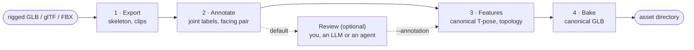

# rig_preprocess: bring your own rigged asset

`rig_preprocess` turns one rigged 3D asset (GLB, glTF or FBX, animated or not) into an **asset directory** that a trained UniMate model can animate from text: the skeleton conditioning (`cond.npy`), the rest-pose mesh in the model's canonical frame (`<name>.glb`) and a preview to check. It runs the export, joint-annotation, feature-extraction and canonical-bake code of the [UniML3D pipeline](../README.md), so an unseen asset is prepared exactly like the training data, and a training asset reproduces the dataset's copy.

```bash
python -m data_process.rig_preprocess run --input robot.glb --output_dir outputs/rig/robot   # labels, then stops for review
# read outputs/rig/robot/REVIEW.md, correct annotation.json (by hand or with an LLM / coding agent), then build:
python -m data_process.rig_preprocess run --input robot.glb --output_dir outputs/rig/robot \
    --annotation outputs/rig/robot/annotation.json
python -m unimate.inference.sample --exp_dir outputs/unimate_uniml3d_f60_v3_preview --asset outputs/rig/robot \
    --prompt "An object walks forward." --num_repetitions 3 --output_dir outputs/samples/custom
bash scripts/run_animate_motion.sh outputs/samples/custom   # robot.glb, animated per motion
```

## Contents

- [How it works](#how-it-works)
- [Quick start](#quick-start)
- [Inputs](#inputs)
- [Joint labels and facing](#joint-labels-and-facing)
- [Review before the cond](#review-before-the-cond)
- [Outputs](#outputs)
- [Check the result](#check-the-result)
- [Command reference](#command-reference)
- [Reproducing a training asset](#reproducing-a-training-asset)
- [Accuracy](#accuracy)
- [Limitations](#limitations)
- [Troubleshooting](#troubleshooting)

## How it works



1. **Export** (Blender): imports the asset, prunes control and helper bones, converts to Y-up, and writes one clip per animation; an asset without animation becomes one rest-pose clip.
2. **Annotate**: maps each bone name onto UniMate's joint vocabulary (`Bip01_L_Thigh` → `Left Thigh`) and picks the *facing pair*, two joints that define which way the asset faces.
3. **Features**: canonicalizes the rest pose (facing +Z, centred, scaled to diameter 2, grounded) and computes the topology condition.
4. **Bake**: rebuilds armature and mesh in that canonical frame, so generated motion drives the asset without retargeting.

**Requirements.** The repository's `unimate` environment, which includes the pip `bpy` 4.0 module (no separate Blender needed); run from the repository root. CPU only: an asset takes seconds to a minute. LLM labels (the default) need an LLM backend, by default `deepseek-v4-flash` with `DEEPSEEK_API_KEY` ([LLM options](#llm-options)); without one a run falls back to the offline rules with a warning.

## Quick start

```bash
# a GLB, animated or not: stops after the annotation for review (see "Review before the cond")
python -m data_process.rig_preprocess run --input robot.glb --output_dir outputs/rig/robot
# continue from the checked annotation.json
python -m data_process.rig_preprocess run --input robot.glb --output_dir outputs/rig/robot \
    --annotation outputs/rig/robot/annotation.json
# or build directly from the automatic annotation
python -m data_process.rig_preprocess run --input robot.glb --output_dir outputs/rig/robot --no_review

# a known facing pair (raw bone names, right side first)
python -m data_process.rig_preprocess run --input creature.fbx --output_dir outputs/rig/creature \
    --face_r R_Thigh --face_l L_Thigh

# one species' {Species}-{Action}.fbx clips, keeping them for in-betweening and editing
python -m data_process.rig_preprocess run --input clips/Parrot-*.fbx --output_dir outputs/rig/parrot --save_clips

# the wrapper: options as environment variables, arguments after -- passed to run
INPUT=robot.glb OUTPUT_DIR=outputs/rig/robot SAVE_CLIPS=1 bash data_process/scripts/run_rig_preprocess.sh -- --overwrite
```

## Inputs

**Formats.** GLB, glTF or FBX with one armature. A skinned mesh is optional; without one there is no canonical GLB.

**Animation.** Each animation (glTF animation or FBX action) becomes a clip, and the skeleton is pruned with the dataset's motion-aware rules (bones that never move, static or stretching leaves). An asset without animation is pruned by the motion-free rules only, so it keeps a few unskinned end bones (`*_End`, `*Nub`) an animated export would drop.

**Profile.** The dataset whose processing to reproduce. The default, `auto`, suits almost every input.

| Profile | Reads | Use for | Differences |
|---|---|---|---|
| `auto` (default) | any | everything | `truebones` for several `{Species}-{Action}.fbx` clips of one species (with `--annotate dataset`: the dataset of `--dataset_export_dir`), else `general` |
| `general` | GLB, glTF, FBX | robots, multi-mesh characters, any single file | skin weights from every skinned mesh; `_tip` leaves kept; rest-pose frames kept; 4 to 180 joints |
| `objaverse` | GLB, glTF | single-mesh GLBs like Objaverse-XL | skin weights from the largest mesh; rest-pose frames removed; 4 to 180 joints |
| `truebones` | FBX | one species' `{Species}-{Action}.fbx` clips | the species exporter; 8 to 150 joints |

**Name.** The asset name (its *object type*) is the file stem with `-`, whitespace and `[ ] * ?` replaced by `_` (`my-robot.glb` → `my_robot`); a Truebones clip set is named after its species. `--name` sets another; it may not contain `- / \ [ ] * ?`.

**Joint budget.** The UniML3D models are trained on skeletons of up to 70 joints and take at most 71 (one slot for the joint-addition augmentation). `summary.json` records whether the asset fits (`--exp_dir <run>` checks against that run instead). A larger rig, common for game characters with full fingers and face bones, must be simplified before sampling.

## Joint labels and facing

The model is conditioned on two things a bare rig does not provide:

- **Joint labels.** Every bone is mapped onto one anatomical vocabulary shared by all training skeletons (`mixamorig:LeftUpLeg`, `Bip01_L_Thigh`, `left_hip_pitch_link` → `Left Thigh` / `Left Hip`), so the same body part has the same embedding on every rig.
- **Facing pair.** Two joints, a left / right pair such as the thighs or a head / tail pair for snakes and fish, define the asset's forward direction. The canonical rest pose faces +Z, and generated motion moves relative to it.

| `--annotate` | Source |
|---|---|
| `llm` (default when an LLM is configured) | The pipeline's LLM labeller and facing-pair selector, the source of the training labels before review; a failed call, or a pair that defines no facing, keeps the rule result |
| `rule` (default without an LLM) | Offline and deterministic: a rule-based cleaner with a vocabulary learned from the reviewed training labels, rig-level refinements (limb chains, sides, finger numbering), geometric labels for mostly unnamed rigs, then a lookup of the reviewed training labels: a rig with the same bone tree as a training rig (Mixamo, Biped, CAT, Rigify and similar templates) takes that rig's labels, and bone names with a consistent reviewed label replace placeholder labels |
| `dataset` | A training asset's own reviewed labels and facing pair, matched by raw bone name; reproduces the dataset exactly |

`--annotate_names` / `--annotate_face` take the labels or the pair from another source; given alone, the other source is `rule` (`--annotate_face llm`: rule labels with an LLM pair). `--face_r` / `--face_l` set the pair by hand in any mode, and no LLM pair is requested then (raw bone names, right or head first; `--body_axis` for a head / tail pair). A selected pair whose joints are not separated horizontally in the rest pose defines no facing: the asset keeps its authored facing, with a note. A hand-given pair like that is an error.

## Review before the cond

Automatic labels cover common rigs well, but an unusual rig can get wrong labels or a wrong facing pair (abbreviated bone names such as `fr_uleg` or `arm_link_sh0` are the usual cause), and both are baked into `cond.npy`. So by default a run stops after the annotation, before anything is built, so the result can be checked by hand or by your own LLM or coding agent (`--no_review` skips this):

```bash
python -m data_process.rig_preprocess run --input creature.glb --output_dir outputs/rig/creature
# read outputs/rig/creature/REVIEW.md and correct annotation.json, then:
python -m data_process.rig_preprocess run --input creature.glb --output_dir outputs/rig/creature \
    --annotation outputs/rig/creature/annotation.json
```

| File | Content |
|---|---|
| `annotation.json` | Every joint's raw name, parent, label and the label's `source`: `template` (a training rig with the same bone tree), `names` (a bone name with a consistent reviewed label), or `rule` / `llm` (`file` when built from an annotation file). Joints worth a look have `"check": true` and `reasons`: a placeholder label (`Bone`), a label outside the vocabulary, or Left / Right limbs that lie the other way round from the facing pair. The facing pair has its own flags (missing, a head / tail axis, a part other than hips, shoulders, limb roots or fins, contradicted by most mirrored limbs). Also: the alternative pairs the labels offer, the run's notes (e.g. an upside-down rest pose), and the vocabulary |
| `annotation_preview.png` | The exported rest pose with the facing pair and the forward direction it gives (green arrow), and every joint as `[index] label` |
| `REVIEW.md` | The flagged joints and notes, what to check, the command that continues (with the first run's options), and a request to give an LLM or coding agent together with `annotation.json` |

Edit only `label`, `face_pair.right`, `face_pair.left` and `face_pair.body_axis` (`true` or `false`), and keep `format`. `--annotation` validates the file before building: raw names unchanged, every label a non-empty string, a facing pair of two different joints of the asset that define a facing (or none). Labels outside the vocabulary are kept, with a note. Add `--review` to an `--annotation` run to regenerate the review files, `annotation.json` included, from the edited file without building. `--annotate dataset` takes already reviewed labels and builds directly; `--review` is not available with it.

Continuing a review (`--annotation`, with or without `--review`) replaces it without `--overwrite`; the review files stay until the edited file has loaded, so a rejected edit can be fixed and the same command rerun. `annotation.json` is never deleted: a run that would not read it stops, and with `--overwrite` moves it to `annotation.json.bak` (`.bak2`, ...). A run from an annotation file elsewhere keeps a copy as `annotation.json`.

The flags point at likely errors; they are not a complete check ([Accuracy](#accuracy)). Read the whole list.

## Outputs

```
<output_dir>/
├── cond.npy         {name: cond}: the skeleton conditioning the sampler reads
├── <name>.glb       the canonical rest-pose asset, with its joint order stored in the file
├── <name>.fbx       with --formats glb,fbx
├── preview.png      what to check before sampling
├── motions/         with --save_clips: the asset's clips as stage 4 feature NPZs
├── summary.json     what was done, and what to watch
└── work/            with --keep_intermediate: every stage's output in the dataset layout
```

A review run writes `annotation.json`, `annotation_preview.png`, `REVIEW.md` and `summary.json` instead. `cond.npy` is the primary output: when the canonical GLB cannot be built (no skinned mesh, a degenerate skeleton), the cond is still written and `summary.json` says why.

<details>
<summary><code>summary.json</code> fields</summary>

| Field | Meaning |
|---|---|
| `name` | Asset name, the key of `cond.npy` |
| `inputs`, `profile`, `profile_auto` | Files read, profile used, whether `auto` chose it |
| `animated` | Whether the asset had animation |
| `annotate`, `annotate_names`, `annotate_face`, `annotation`, `annotation_notes` | Label and facing-pair sources (`annotate: file` with `--annotation`, whose path is `annotation`) and the annotation step's notes |
| `face_pair` | Raw and cleaned names of the facing pair, and how it was chosen |
| `n_joints_export`, `n_joints` | Joints after export and in the cond |
| `n_clips`, `clips` | Clips that passed stage 4's filters; those kept in `motions/` |
| `stats_dataset` | Dataset whose normalization statistics the sampler applies |
| `model_joint_limit` | `{max_joints, source, fits}` |
| `dropped_translation` | Largest translation of a non-root joint in the clips, as a share of the skeleton's size |
| `rest_rotation` | The `--rest_rotation` applied |
| `notes` | Everything worth a look: dropped translation, an upside-down rest pose, too many joints, no canonical GLB |
| `cond`, `canonical_glb`, `canonical_fbx`, `canonical_glb_error`, `preview` | Output paths, or why the GLB is missing |
| `rig_glb` | The export stage's rest-pose GLB when kept (`--keep_intermediate`), else null |
| `stage`, `review` | review runs only: `stage: review`; the annotation path, flag counts and the command that continues |
| `reference`, `dataset_sidecars`, `root_offsets_applied`, `rest_orientations_applied` | `--annotate dataset` only: the dataset reproduced and what was taken from it |

</details>

## Check the result

`preview.png` has three panels: the canonical rest pose with the facing pair (red: right or head; blue: left or tail) and the forward direction (grey arrow, +Z); a front view, where the asset's face or chest should be visible with its right side on the image's left; and every joint with its label. Then read `notes` in `summary.json`.

| You see | Do |
|---|---|
| The asset faces sideways or backwards | Set the pair: `--face_r <right bone> --face_l <left bone>`, or correct it with `--review` |
| Wrong or many `Bone` labels | Correct `annotation.json` before building; with `rule` labels, set an LLM key and run again |
| The rest pose lies down or is upside down | `--rest_rotation x180` (upside down) or `x90` / `x-90` (on its back / front); turns compose, e.g. `x90,y180` |
| `model_joint_limit.fits` is false | Remove finger, face or accessory bones from the rig |
| A note that a joint translates | Expected: the model generates rotations and the root path, so sliding or stretching bones keep their rest length |
| No canonical GLB | The asset has no skinned mesh; the cond still samples, but there is no mesh to drive |

Re-run with `--overwrite` after changing anything.

**Using the asset.** Pass the directory to the sampler; only the named assets are read, so no dataset is needed. The sampler's `manifest.json` records the asset of every motion, and `scripts/run_animate_motion.sh <samples_dir>` checks motion, cond and mesh before driving the mesh. With `--save_clips`, in-betweening and motion editing can hold the asset's own clips. See [Inference](../../README.md#-inference) in the top-level README.

## Command reference

### `run`

`python -m data_process.rig_preprocess run --input FILE [FILE ...] --output_dir DIR [options]`

| Option | Default | Description |
|---|---|---|
| `--input` | required | The asset; several `{Species}-{Action}.fbx` clips for the Truebones profile |
| `--output_dir` | required | The asset directory to write |
| `--profile` | `auto` | `auto`, `general`, `objaverse` or `truebones` |
| `--name` | from the file | Asset name (not with `--annotate dataset` or the Truebones profile) |
| `--annotate` | `llm` when the `--model` key is set (`DEEPSEEK_API_KEY` for the default, `OPENAI_API_KEY` for a `gpt-*` model) or a local model is used, else `rule` | `llm`, `rule` or `dataset` |
| `--annotate_names`, `--annotate_face` | `--annotate` | `rule` or `llm` for one of the two |
| `--face_r`, `--face_l`, `--body_axis` | none | The facing pair by hand |
| `--review` / `--no_review` | review, except with `--annotation` or `--annotate dataset` | Stop after the annotation and write the review files / build directly |
| `--annotation` | none | Build from a reviewed `annotation.json` (not with `--annotate llm` / `dataset`, `--annotate_names`, `--annotate_face`, `--face_r`, `--face_l`, `--body_axis`) |
| `--rest_rotation` | none | Axis turns in degrees, applied in order (`x180`, `x90`, `x90,y180`) |
| `--save_clips` | off | Keep the clips in `motions/` |
| `--formats` | `glb` | `glb` (always) and `fbx` |
| `--no_preview` | off | Skip `preview.png` |
| `--exp_dir` | none | Check the joint count against this run (default 71, the UniML3D models' limit) |
| `--fps` | `30` | Frame rate of the exported clips |
| `--keep_intermediate` | off | Keep `work/` |
| `--overwrite` | off | Replace an earlier output of this tool |
| `--dataset_export_dir` | `dataset/export/<profile>` | `--annotate dataset`: the export with the asset's reviewed entries |
| `--patch_dir` | `dataset/UniML3D/patches` | `--annotate dataset`: root-offset and rest-orientation patch files, applied when present (the released export already includes them) |

<a id="llm-options"></a>**LLM options** (an `llm` source): `--model` (an OpenAI, DeepSeek or Hugging Face model id), `--backend local|openai` (default: from the model), `--api_key` (default `OPENAI_API_KEY` / `DEEPSEEK_API_KEY`), `--base_url`, `--max_tokens` (default 8192), `--max_retries`, `--reasoning_effort`, `--torch_dtype`, `--device_map`, and `--rig_timeout` (seconds per call before the rule fallback, default 300). `run -h` lists defaults.

### `verify` and `evaluate`

```bash
python -m data_process.rig_preprocess verify --output_dir DIR [--profile DATASET] [--dataset_root dataset] [--report FILE]
python -m data_process.rig_preprocess.evaluate [--datasets objaverse truebones] [--split dev|test] [--rows FILE]
```

`verify` compares an output with the dataset's copy of the asset ([below](#reproducing-a-training-asset)) and exits 1 on a difference. `evaluate` scores `rule` annotation against the reviewed labels ([Accuracy](#accuracy)).

### Wrapper and Python API

`data_process/scripts/run_rig_preprocess.sh` maps environment variables to options and passes arguments after `--` to `run`:

| Variable | Option |
|---|---|
| `INPUT` (required; a glob or space-separated list, no spaces in paths), `OUTPUT_DIR` (required) | `--input`, `--output_dir` |
| `PROFILE`, `ANNOTATE`, `ANNOTATE_NAMES`, `ANNOTATE_FACE`, `NAME` | `--profile`, `--annotate`, `--annotate_names`, `--annotate_face`, `--name` |
| `FACE_R`, `FACE_L`, `BODY_AXIS=1` | `--face_r`, `--face_l`, `--body_axis` |
| `REVIEW=1` / `REVIEW=0`, `ANNOTATION` | `--review` / `--no_review`, `--annotation` |
| `REST_ROTATION`, `SAVE_CLIPS=1`, `FORMATS`, `EXP_DIR` | `--rest_rotation`, `--save_clips`, `--formats`, `--exp_dir` |
| `VERIFY=1` | run `verify` afterwards, when the asset was built |
| `CONDA_ENV` | environment to activate (default `unimate`) |

```python
from data_process.rig_preprocess.pipeline import preprocess   # needs bpy
summary = preprocess(['robot.glb'], 'outputs/rig/robot', save_clips=True, face_r='R_hip', face_l='L_hip')
```

`preprocess` takes the `run` options as keyword arguments (`review=True`, `annotation=path`; unlike `run`, it builds directly unless `review=True`, and labels with `annotate_mode='rule'` unless told otherwise) and returns the `summary.json` dict. `verify.verify`, `evaluate.evaluate` and `review.build_annotation` / `review.load_annotation` do not need bpy.

## Reproducing a training asset

`--annotate dataset` takes a UniML3D asset's reviewed labels and fixes; `verify` compares the result with `<dataset_root>/features/<ds>/cond.npy` and `<dataset_root>/canonical_assets/<ds>/`:

```bash
python -m data_process.rig_preprocess run --input <training asset> --output_dir out --annotate dataset --profile objaverse
python -m data_process.rig_preprocess verify --output_dir out
```

Verdicts, for the cond and the canonical GLB separately: **`identical`** (within 1e-4 of the extent for positions and meshes, 1e-5 for rotations and eigenvectors); **`equivalent`**, the same skeleton described differently (sibling order, quaternion sign, bone axes with equal joint positions, eigenvector sign or another basis of a repeated Laplacian eigenvalue, chains split differently at a branch; listed under `notes`); **`different`** (listed under `differences`).

## Accuracy

**Rule annotation** against the reviewed UniML3D labels (LLM output, human review and fixes). Rigs are split into two halves by name hash; each half is scored with the vocabulary and label lookup learned on the other half only. Measured 2026-10-04 (`evaluate --split test`, `--split dev`):

| Held-out half | Joint labels | Same facing pair | Same facing (≤ 10°) |
|---|---|---|---|
| Objaverse, test (3,669 rigs) / dev (3,686) | 93.9% / 94.8% | 91.5% / 92.8% | 97.9% / 98.4% |
| Truebones, test (33 species) / dev (41) | 89.9% / 91.6% | 97.0% / 92.7% | 97.0% / 97.6% |

The facing is what reaches the model; different pairs (hips or shoulders) usually give the same facing. Template rigs (Mixamo, Biped, CAT, Rigify) come out almost exactly as reviewed; errors concentrate in one-off rigs with unusual names and in robots, whose link names have the least reviewed vocabulary. Use `--review` for those.

**Review flags** on the same held-out test halves: on Objaverse, 84% of flagged joints were ones the reviewers relabelled, and the flags caught 42% of all relabelled joints; on Truebones, 44 of 44 flagged joints were relabelled (27% of all relabelled joints). The facing pair is flagged on 5% of Objaverse rigs, which hold a third of the wrong facings (25 of 77): a flagged pair means "check the arrow", not "wrong", and an unflagged one still deserves a look at the preview.

**Effect on generated motion.** Training assets were sampled with the same prompts and noise twice: with the dataset's reviewed conditioning and with this tool's `rule` output. With the same labels and facing pair, the motions are the same (mean joint difference below 0.2% of body size). With 57 to 92% of labels the same and the same pair, the motion changes less than a second sample of the prompt would. A different facing pair, or mostly wrong labels, gives a different motion.

## Limitations

- **Rotations only.** The model generates joint rotations and the root trajectory; sliding or stretching bones keep their rest length (reported in `summary.json`).
- **Rest orientation.** A rig authored lying down or upside down is not stood up automatically (an upside-down pose is flagged); use `--rest_rotation`.
- **No skinned mesh.** The cond is written, but there is no canonical GLB, and pruning keeps fewer joints, since skin weights mark deforming bones.
- **Joint budget.** Rigs over the model's limit are reported, not simplified.
- **Full character skeletons.** A Mixamo character keeps all its bones (65 for Y Bot), while UniML3D trains Mixamo motion on 22 core joints; such an asset is sampled as an unseen skeleton.
- **Automatic labels can be wrong** on rigs with unusual names (often robots), from the LLM or the rules: check them in the review step.

## Troubleshooting

| Message | Cause and fix |
|---|---|
| `profile 'objaverse' reads .glb/.gltf files, got …` | Use `--profile general` or the default `auto` |
| `… exists; pass --overwrite to redo the asset` | `--output_dir` holds an earlier output: add `--overwrite` or choose another directory |
| `… is not a rig_preprocess output` | `--overwrite` only replaces a directory this tool wrote |
| `… holds a review of …` / `… annotation.json exists and may hold edits` | Continue with the `--annotation` command shown, or add `--overwrite` (the old file becomes `annotation.json.bak`) |
| `…: joints do not match the exported skeleton` / `empty label for …` / `face_pair …` / `must be true or false` | The edited `annotation.json` changed a raw name, left a label empty, has a wrong type, or names an incomplete, unknown or vertical facing pair: fix it and rerun the same command |
| `asset name … must be non-empty and hold none of …` | Pass a valid `--name` |
| `the exported skeleton has N root bones` | Parent the roots under one, or add the skinned mesh that tells which one deforms |
| `stage 4 produced no cond for …` | Re-run with `--keep_intermediate`; read `work/features/extract_errors.log` and `filtered_clips.json` |
| `face pair … has no horizontal separation in the rest pose` | The hand-given joints lie on a vertical line: choose two side by side, or a head / tail pair with `--body_axis` |
| `--annotate dataset needs a stage-3 dataset export` / `… has no stage-3 entry` | `dataset` mode needs a training asset and its dataset export (`--dataset_export_dir`) |
| `--rest_rotation is for unseen assets` | `--annotate dataset` applies the dataset's own rest orientation |
