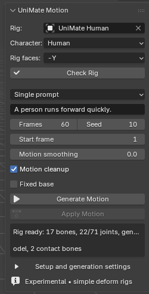
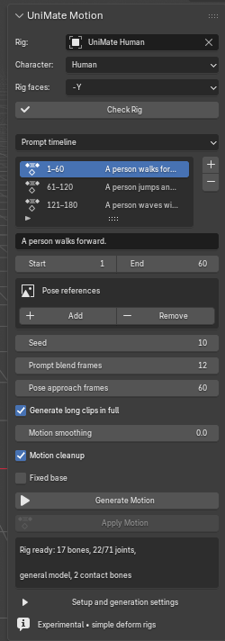
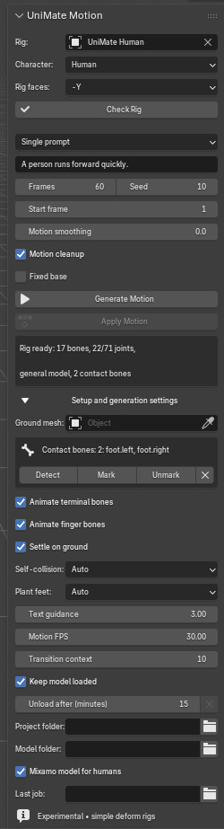

# Blender add-on panel guide

The **UniMate Motion** panel is in the 3D View sidebar: press **N**, then select the **UniMate** tab. Set up the [local backend and model](../README.md#install) before generating. The panel describes motion for a simple deform-bone rig and creates an editable Blender Action; generation runs outside Blender in a local Python process.

## Rig and character

| Control | What it does |
| --- | --- |
| **Rig** | Select the armature to animate. If left empty, the add-on uses the selected armature or the armature of a selected skinned mesh. The chosen armature must contain deform bones. |
| **Character** | Chooses the UniMate dataset-statistics family used to normalize the rig: **Human**, **Animal / Creature**, or **Other articulated model**. Pick the closest family for the rig. This is not an automatic retargeting or species-detection control. The human image-pose estimator is available only with **Human**. With **Human**, generation uses the Mixamo-only model when the rig fits its 22 joints (see **Mixamo model for humans**). |
| **Rig faces** | The world direction the character faces in its rest pose: **−Y**, **+Y**, **+X**, or **−X**. The default is **−Y** (Blender's front view looks along +Y, so a character facing the front view faces −Y). The armature object's rotation and uniform scale are taken into account, so rigs imported Y-up or at 0.01 scale, such as Mixamo FBX files, work without applying transforms. **Check Rig** warns when the feet point another way. If generated travel goes sideways or backward, check this before changing the prompt. |
| **Check Rig** | Exports and validates the deform skeleton without starting inference. It reports the model-joint count in the status area. The rig needs at least five model joints and must stay within the selected checkpoint's limit (71 for the provided v2 model). Virtual terminal joints also count if enabled. Check again after changing the rig, **Animate terminal bones** or **Animate finger bones**. When the rig has too many joints, the message says which of those options to turn off. |

Use a simple single-root deform hierarchy. Active pose constraints, drivers, NLA tracks, and control rigs are not supported directly. **Check Rig** cannot prove that the model will produce a natural motion for every skeleton; inspect the generated Action.

## Choose a workflow

**Workflow** switches between **Single prompt** and **Prompt timeline** (the default). Both use the rig, character family, forward axis, cleanup toggle, and advanced setup fields above and below the workflow controls.

### Single prompt

The screenshot above shows the single-prompt controls.

| Control | What it does |
| --- | --- |
| **Motion** | Describe one action in natural language, such as “A person runs forward quickly.” It must be nonempty. Include the direction or style that matters most; a text prompt does not specify a collision target or exact trajectory by itself. |
| **Frames** | Number of generated frames, from **2 to 60**; default **60**. The model produces a 60-frame window and shorter requests use its beginning. For a longer sequence, use **Prompt timeline**. |
| **Seed** | Nonnegative random seed; default **10**. Reuse the same seed and settings to compare prompts more consistently. Changes in model files or other settings can still change the result. |
| **Start frame** | Blender frame at which **Apply Motion** places the first generated pose; default **1**. This does not change how many frames the backend generates. |

**Motion FPS** in advanced settings sets the timing interpretation for a single-prompt result. When applying the result, the add-on accounts for the scene's current FPS. The prompt and settings do not give the model scene geometry awareness; **Motion cleanup** is a later correction pass.

### Prompt timeline

Use a timeline when the character should perform multiple described actions. The list shows each clip's inclusive frame range and prompt. Select a row to edit that clip.

| Control | What it does |
| --- | --- |
| **+ / − beside the clip list** | Add or remove a prompt clip. A new clip starts immediately after the previous clip and initially spans 60 frames. Removing a clip does not automatically renumber the others; fix the remaining ranges before generation. |
| **Prompt** | Text for the selected clip. Every clip needs a nonempty description. |
| **Start / End** | Inclusive Blender frames for the selected clip. Clips must be ordered and contiguous: for example, **1–60**, **61–120**, **121–180**, with no gap or overlap. Each clip must cover **2–600 frames**. The whole sequence can contain at most **32 clips** and **10,000 frames**. The model generates 60-frame windows. With **Generate long clips in full**, a clip gets as many chained windows as its length needs (with the default **Transition context** of 10, each later window repeats 10 frames as context and adds 50 new ones), then the result is retimed to the exact span, so a 180-frame clip contains about three windows of motion. |
| **Seed** | Nonnegative seed for the generation job; default **10**. The same seed is used by the timeline request, while the prompts and prior clips affect each window. |
| **Prompt blend frames** | Smooths the final motion across a clip boundary for **0–120 output frames**; default **12**. Use a larger value if a join snaps, but review short clips because a long blend can soften the intended change. **0** disables this join correction. |
| **Generate long clips in full** | On by default. Chains extra model windows for clips longer than one window, so long clips gain motion instead of being stretched. Pose references are placed in whichever window covers their frame. Turn it off to stretch a single window over the clip (slower-looking motion, faster generation). |
| **Pose approach frames** | For captured pose references, eases into each target over up to **0–600 output frames** within its clip; default **60**. This deliberately replaces the incoming motion with a pose blend. **0** leaves the approach unblended. It has no effect if there are no captured references. |

The timeline uses the Blender scene's FPS at generation time. Keep that FPS unchanged until **Apply Motion**; the add-on checks it before applying. **Transition context** in advanced settings is different from **Prompt blend frames**: context carries model samples into the next clip during generation, while blending corrects the decoded animation at the join.

## Pose references in a clip

References belong to the selected prompt clip. They target **poses at particular frames**, not a full motion path. Set the clip and frame first, then capture the pose you want.

| Control | What it does |
| --- | --- |
| **Add / Remove** | Add or remove a reference on the selected clip. A new reference starts at that clip's first frame. A clip can have several references, but each must target a different frame. |
| **Reference index (0-based)** | Appears when a clip has multiple references. Selects which reference the controls below edit; index **0** is the first. |
| **Reference frame** | Target frame for this pose. It must fall inside the selected clip. References placed too close together may map to the same model frame; generation will ask you to space them farther apart. |
| **Image field / Choose Reference Image** | An optional local PNG, JPEG, WebP, or BMP image for visual guidance. The chosen image is displayed as a thumbnail when readable. Choosing another image clears the previous estimate and captured pose, so review and capture again. An image path alone does **not** constrain generation. |
| **Estimate Human Pose** | With **Character: Human**, runs the local human pose estimator on the chosen image. Set up the project first so the pose model is available. It estimates a **single** person; hidden limbs, depth, and ground contact need manual review. This button is not available for creature or other articulated families. |
| **Preview Estimated Pose** | Applies the estimated landmarks to the selected human rig for review. It is disabled until estimation finishes. Preview does not save a reference constraint. |
| **Human bone mapping** | Expands the mapping from human landmark roles to rig bones. **Auto-map Human Bones** guesses the names; inspect the fields and pick the correct bone for any wrong or missing role before previewing. Mapping is shared at the scene-panel level. |
| **Capture Current Pose** | Saves the current selected rig pose as the constraint for this reference. For a human, preview the estimate, adjust the rig in Pose Mode, then capture. For a creature, pose the rig manually against the image and capture. You can capture without an image when you want to author the target pose yourself. |
| **Pose captured / No pose captured yet** | Confirms whether this reference has a saved pose. Every reference must be captured before generation. Capture again if the rig's rest skeleton changes, or after changing **Rig faces**, **Animate terminal bones** or **Animate finger bones**, since those change the exported skeleton. |

The captured target constrains joint rotations, root height and the facing direction at its frame while letting the model generate horizontal movement. Capture the pose facing the way the character should face at that frame; for example, after a clip that turns the character around, a target captured in the rest orientation turns it back. A target pose that intersects the character or ground can be adjusted by **Motion cleanup**. If exact captured rotations matter more, turn cleanup off and review collisions yourself. The estimator and preview do not guarantee a physically plausible transition; adjust **Pose approach frames** and inspect the resulting Action.

## Generation and cleanup

These controls sit below either workflow:

| Control | What it does |
| --- | --- |
| **Motion cleanup** | Enabled by default. After inference, estimates self-collisions using proxies derived from the rig's weighted meshes, corrects ground contact and penetration, and limits extreme foot or paw tilt and support-limb bend. It is a heuristic pass, not a physics simulation; inspect hands, knees, paws, and ground contact. Disabling it also skips the optional ground mesh. |
| **Generate Motion** | Validates the rig, model files, and selected workflow, then starts a local backend job. Blender remains interactive. For a timeline, all clip ranges and captured references are checked first. This button becomes **Cancel Generation** while a job is running. |
| **Cancel Generation** | Stops the currently running generation or pose-estimation process. A later generation starts a new job. |
| **Apply Motion** | Becomes available after a successful job has written `motion.npz`. It creates a new editable Action on the selected rig. In single-prompt mode it starts at **Start frame**; in timeline mode it starts at the first clip's **Start**. Save the `.blend` file to keep the Action. |
| **Status box** | Shows rig-check results, job progress, completion, and errors. If a job fails, check `worker.log` in its job folder. |

Each job lives under the configured project's local `outputs/` folder and contains a request, status, log, and result. Those generated files are excluded from Git and are not required to open the included demo scene.

## Setup and generation settings

Expand **Setup and generation settings** to configure the backend and less commonly changed options.

| Control | What it does |
| --- | --- |
| **Ground mesh** | Optional independent, non-deforming mesh used as a static contact surface when **Motion cleanup** is on. The add-on exports up to **20,000 triangles**. Leave it empty to use the rig's rest-sole level as a fallback plane. A visible ground plane is useful even when no mesh is assigned for cleanup, because it makes contact easier to inspect. |
| **Animate terminal bones** | Enabled by default. Adds virtual endpoint joints to the exported skeleton so motion can reach terminal bones. These joints count toward the model's joint limit; turn this off if **Check Rig** reports too many joints. |
| **Animate finger bones** | Enabled by default. Turn it off to leave finger and thumb bones (and their children) out of the export; they keep their rest pose. Bones are recognized by names such as *thumb*, *index*, *middle*, *ring* and *pinky*. A Mixamo character with fingers exports 52 bones (65 model joints with terminal bones), within the general model's 71. Without fingers it has 22 bones: 27 model joints with terminal bones, or exactly 22, the Mixamo model's skeleton, without them. |
| **Text guidance** | Classifier-free text guidance scale, **1.01–20**, default **3**. It controls how strongly sampling follows the prompt. Adjust in small steps and compare results with a fixed seed; stronger guidance does not guarantee better anatomy or contact. |
| **Motion FPS** | **1–120**, default **30**. Used for single-prompt output timing. In **Prompt timeline**, the request uses the Blender scene's FPS instead. It changes playback interpretation, not the number of generated model frames. |
| **Transition context** | **1–30** model frames, default **10**. During timeline generation, the tail of the prior model window is supplied as known context to the next prompt. It may improve continuity at the source-motion level. It also sets how many frames each chained window repeats, so larger values leave fewer new frames per window (60 minus this value) and need more windows for a long clip. For the visible final join, tune **Prompt blend frames**. This field has no effect on a single prompt. |
| **Keep model loaded** | On by default. Keeps the backend process and model in memory after a generation, so the next one skips loading. It uses GPU memory while loaded. **Cancel Generation** stops it, and the next run loads again. |
| **Unload after (minutes)** | **1–240**, default **15**. Stops the loaded backend after this long without a generation. The **X** button beside it unloads immediately. |
| **Project folder** | Root of the configured local UniMate-B3D clone. It must contain the backend worker and `.venv` Python environment produced by setup. Set this before generation or human pose estimation. |
| **Model folder** | Folder with the UniMate checkpoint, `config.json`, and `dataset_stats.npy`; with the provided setup, choose `models/unimate_uniml3d_f60_v2` inside the clone. The model's joint limit comes from its config. |
| **Mixamo model for humans** | On by default. For **Character: Human**, uses the Mixamo-only checkpoint (`models/unimate_mixamo_f60`, downloaded by setup beside the general model) when the rig has at most 22 model joints, its training skeleton. It produces clearly more natural human motion than the general model. Larger rigs, other characters, or a missing download use the **Model folder** model. **Check Rig** names the model it will use and which options to turn off to reach the Mixamo model. |
| **Last job** | Path of the most recent local job. The add-on fills it after starting generation. **Apply Motion** reads its request and `motion.npz`; you can point it at a previous complete job to apply that result again, provided the rig and timeline timing still match. |

The final **Experimental · simple deform rigs** line is a scope reminder, not a setting. The panel does not offer obstacle-aware path planning or a guarantee of collision-free output. For a jump over a specific cube, review and edit the resulting Action against the scene; the [included demo](../demo/UniMate_Run_Jump_Sword.blend) shows such an edited action.
